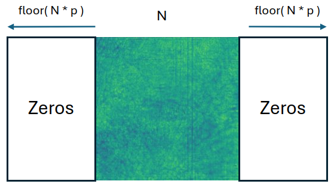
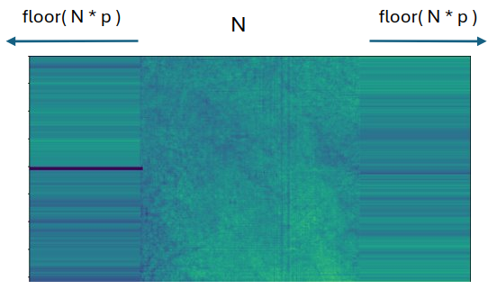
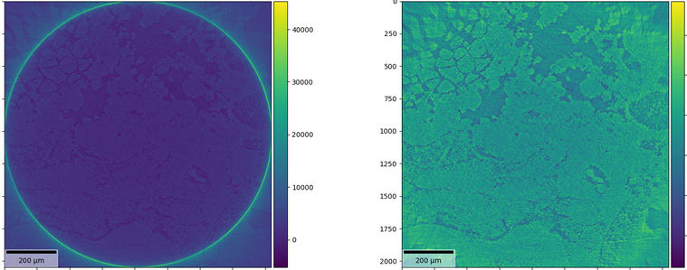

(padd)=
# Padding

Padding strategies are a common technique used on numerical transforms, especially Discrete Fourier Transforms (DFTs) implemented via the Fast Fourier Transform (FFT) algorithm.
Different padding strategies are used depending on what you want to achieve — e.g., controlling edge effects, preserving statistics, or enforcing periodicity.

In the case of ``sscRaft`` processing and reconstruction methods, zero-padding and edge-padding are used to tackle different issues or artifacts.

## General Usage

For all methods that uses FFT, we implemented a padding strategy. It can be accessed by the dictionary entries ``'padding'`` and ``'padd_mode'``, as the ``FDK`` example below:  

```python
    import numpy
    import sscRaft

    '''Load data-set
    tomogram = ...
    '''

    angles = numpy.linspace(0, 2.0*numpy.pi, tomogram.shape[1])

    reconstruction = sscRaft.fdk(tomogram, dic = {'gpu': [0,1], 'angles[rad]': angles, 'beta/delta': 0.0
                                                  'detectorPixel[m]': 3.61e-6, 'z1[m]':1000e-3, 'z1+z2[m]':2000e-3, 'z2[m]':500e-3, 
                                                  'energy[eV]': 22e3, 'filter': 'hamming',
                                                  'padding': 0.25,
                                                  'padd_mode': 'zero'})
```

The filtering step on the ``FDK`` method requires a FFT and the user has the option to change the size of the padding and its strategy.

1. ``'padding'`` ({math}`p`):  a float value that controls the size of the padding. It is a percentage of the data size {math}`n`,

```{math}
padsize = floor(p * n).
```

The final dimension of the padded data is {math}`n + 2 * padsize`, as explained below.


2. ``'padd_mode'``: a string that sets the padding strategy. The strategies implemented are zero-padding ``'zero'`` and edge-padding ``'edge\'``.

The padding is centered around the image with size {math}`padsize` at the left and at the right. The zero-padding extends the image boundary with zeros, as seen in Figure 1.
The edge-padding replicates the last column, as seen in Figure 2.

|  |  |
| :-------: | :-------: |
| Figure 1: Zero-padding | Figure 2: Edge-padding |


### Zoom images

The padding strategy is also very useful to remove the cicle artifact that appears in zoom reconstructions, illustrated in Figure 3. 


|  |
| :-------: | 
| Figure 3: Zoom reconstruction. On the left, illustration of the cicle artifact. On the right, the artifact removal through edge-padding. | 


```python
    import numpy
    import sscRaft

    '''Load data-set
    tomogram = ...
    '''

    angles = numpy.linspace(0, 2.0*numpy.pi, tomogram.shape[1])

    reconstruction = sscRaft.fdk(tomogram, dic = {'gpu': [0,1], 'angles[rad]': angles, 'beta/delta': 0.0,
                                                  'detectorPixel[m]': 3.61e-6, 'z1[m]':1000e-3, 'z1+z2[m]':2000e-3, 'z2[m]':500e-3, 
                                                  'energy[eV]': 22e3, 'filter': 'hamming',
                                                  'zoom padding': 0.25,
                                                  'zoom padd_mode': 'edge'})
```